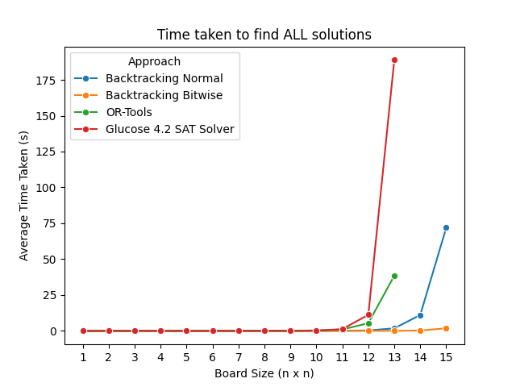
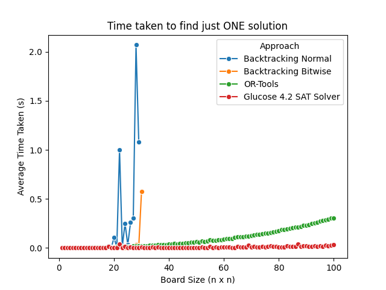

# N-Queens
Several solutions were implemented for this problem, using OR-Tools, a SAT solver (from PySat), and manually implemented backtracking solutions in C++.

The library solutions require less information and background, so they are presented here first. Actually, the order presented here is in descending order of abstraction (or ascending order of complexity of implementation). This means that the first solution will be the most abstracted, and likely have the least complex code.

## Measuring Times
To measure and compare the times taken for each board size, we ran the algorithms several times (5 times) for each board size up to the specified size. This allows us to later plot the results and compare techniques.

The maximum board size to test is specified as a command line argument. In each solution, we suggest a feasible board size that won't take too long to run.

## Finding all solutions
For every implemented solution, it is possible to modify the command line parameters for the program, specifying whether to find all or just one solution.


## OR-Tools Solution
The implementation was based on https://developers.google.com/optimization/cp/queens.

This solution uses the OR-Tools library, which uses a Sat solver internally to find a valid solution.

To find just one solution, run:
```bash
python or_tools_solution.py --board_size 8 --print_solutions
```

To find all solutions, run:
```bash
python or_tools_solution.py --board_size 8 --print_solutions --all_solutions
```

#### Measure Times
To measure the times taken to find all solutions, just do:
```bash
python or_tools_solution.py --run_tests all_solutions --board_size 13
```


In the case of just finding one solution, since the solution callback handler is called asynchronously and we can only stop the search when handling a found solution, it may even end up finding more than one solution. Therefore, the time measurements may not be fully precise, but are still somewhat accurate.

To measure the times for one solution, do:
```bash
python or_tools_solution.py --run_tests one_solution --board_size 100
```

## Sat Solver Solution (PySAT)
In this solution, the implementation is focused on transforming the problem into a SAT problem. Basically, we setup the variables and their relations and pass them to the SAT solver.

To find all solutions, run:
```bash
python sat_solution.py --board_size 8 --print_solution --all_solutions
```

To find just one solution, run:
```bash
python sat_solution.py --board_size 8 --print_solutions
```

#### Measure Times
To measure the times taken to find all solutions, just do:

```bash
python sat_solution.py --run_tests all_solutions --board_size 13
```

To measure the times for just one solution:
```bash
python sat_solution.py --run_tests one_solution --board_size 100
```

## C++ Solutions
These are the solutions that we manually implemented. These require a special attention to efficiency.

Additionally, in order to understand these solutions, the reader should have at least a basic understanding of Data Structures and Algorithms (DSA), specifically of backtracking algorithms.

These solutions were tested in an online judge that presents several classic programming problems, like this one. The problem presented there is slightly different and it required some small adjustments to save the obtained solutions: https://leetcode.com/problems/n-queens/description/. Both of the solutions presented here were able to pass the test cases from this online judge.


For these solutions, it is suggested that the commands to run the program are copied and only the parameters should be adjusted (e.g., specify a different board size).

There are 2 files to run corresponding to two different solutions, as we'll see below.


### Efficient Backtracking Solution
To run the normal backtracking solution, which includes efficient checking of valid columns (in constant time instead of the normal linear time), just do:
```bash
g++ backtracking_solution.cpp && ./a.out --board_size 8 --print_solutions --all_solutions && rm -f a.out
```

#### Measure times
Since this takes some time to run, it is advised to just look at the plots. Feel free to run the bitwise solution, though.

To run the timing tests for all solutions:
```bash
g++ backtracking_solution.cpp && ./a.out --run_tests all_solutions --board_size 15 && rm -f a.out
```

To run just for one solution:
```bash
g++ backtracking_solution.cpp && ./a.out --run_tests one_solution --board_size 29 && rm -f a.out
```

For bigger sizes, the time taken to run the solution grows exponentially. For example, for a size of 30, it takes about 40 seconds to find one solution.

### Bitwise Backtracking Solution (more efficient)
To run this solution, which includes only traversal through valid columns through bitwise manipulation, just do:
```bash
g++ backtracking_bitwise_solution.cpp && ./a.out --board_size 8 --print_solutions --all_solutions && rm -f a.out
```

This solution is adapted from https://bpochily.github.io/bitwise-optimization-of-n-queens/ and https://www.cl.cam.ac.uk/~mr10/backtrk.pdf.

#### Measure times
Since this solutions uses bits and 32-bit integers, it does not work for bigger sizes of the board. Actually, it only works up until size 30 (inclusive), because of the way negative values are used in the bitwise operations. Running this solution for bigger sizes than 30 will lead to invalid times, since the solutions are also invalid. Since the time taken to run the solution grows exponentially, and we can already detect at size 30 this trend, we just decided to leave it with 32 bits, instead of changing it to 64 bits. 

To run the timing tests for all solutions:
```bash
g++ backtracking_bitwise_solution.cpp && ./a.out --run_tests all_solutions --board_size 15 && rm -f a.out
```

To measure times for just finding one solution:
```bash
g++ backtracking_bitwise_solution.cpp && ./a.out --run_tests one_solution --board_size 30 && rm -f a.out
```

## Plotting results
To check out the results, you should run:
```bash
python plots.py
```

The results should be something similar to:

- Finding all solutions:



- Finding just one solution:


